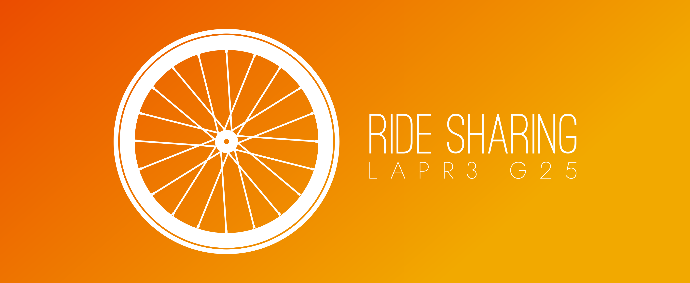
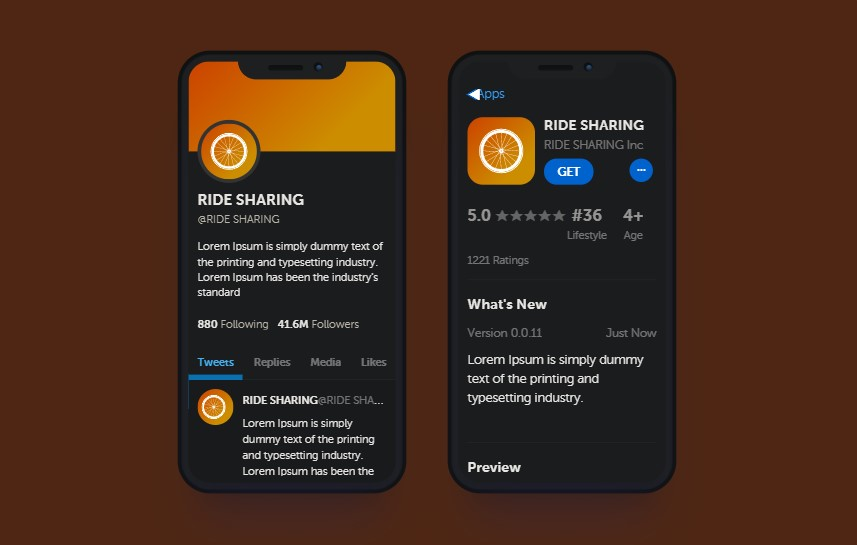
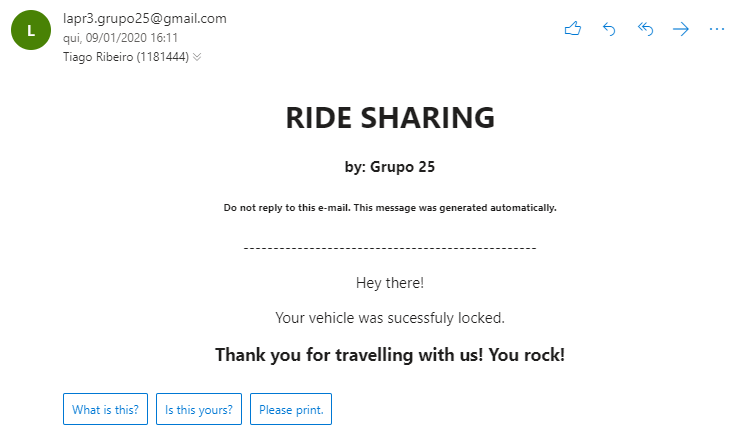

# ISEP-LAPR3-2019/20

-----------------------------

Ride Sharing Logo



-----------------------------

Store Front Mockup


-----------------------------
Ride Sharing Twitter & App Store Templates Examples



-----------------------------

After successfully parking the loaned vehicle, this is the e-mail the user receives.

-----------------------------



-------------

### Topics Below

- Software Engineering
- Report
- References
- Maven Files
- Observations

### Java source files

Java source and test files are located in folder **src**.

# Statement

* [Statement (Enunciado)](LAPR3FinalProject/Statement.pdf)

# Software Engineering

* [Use Cases](LAPR3FinalProject/Documents/UseCases.md)
* [Analysis OO](LAPR3FinalProject/Documents/AnalysisOO.md)
* [Design OO](LAPR3FinalProject/Documents/DesignOO.md)

# Report

## Abstract

This project's about the creation and implementation of a product that supports ride-sharing businesses. This service allows to manage users, bicycles, electric scooters, parks and the pickup and return process of those vehicles. In accordance with the problem presented to us we tried to suit both users and administrators needs.

Overall, we think we developed a good solution for this project.

#### Keywords
* Bicycle
* Scooter
* Park
* Point of interest
* Path
* Distance
* Physics
* Rental
* Invoice
* Receipt
* User
* Administrator
* Database


## Introduction

For LAPR3, the goal of the ride-sharing system was to develop a software solution capable of managing users, as well as allowing administrators to control all of its vehicles (bicycles and Scooters) and vehicle parks, including the pickup and return processes.

To reach this goal, we were instructed to adopt a Test-Driven-Development during the project, use Java, and follow an agile Scrum Methodology aswell as Jira. We we're also required to apply the knowledge acquired in Applied Physcis, Information Structures and Database unit courses, in order to fully develop all of the requested functionalities.

Jira was used to create issues and tasks, aswell as dividing them and planning each Sprint. Each user story was created and assigned to a team member, with focus on:

* Analysis, where it was developed the Use Case Diagram and the System Sequence Diagram.
* Design, where it was developed the Class Diagram, Sequence Diagram.
* Implementation, where code and test code were implemented.
* Review, where it was possible to review the entire implementation.

The Scrum Master of the project had daily meetings with the team to know the status of each User Story, and at the end of each Sprint the Scrum Master created a sprint retrospective.
This report is divided into 3 main parts: Problem Description, Proposed Solution and Withdrawn Conclusions. We will begin by presenting , in a State of the Art section, some available solutions that already exist out there for this type of business , followed by a brief background of the project, that contains its objectives, and finally, a conclusion with a detailed explanation of all the software's functionalities, alongside some integral justifications for our design choices.


## State of the Art

These days, due to the high-density population specially in big cities, there is a lot of daily traffic which makes driving very stressful and sometimes even difficult. Due to overuse of personal cars, a lot of environmental problems are arising such as air pollution. In order to prevent the degradation of our planet it is important to use greener vehicles.

Taking all this into consideration we have implemented a ride sharing system that uses bikes and scooters as means of transportation. We also think that this system might be the best and funniest way to know every corner of a city on two wheels.

After researching, we found some software systems similar to ours in Portugal, where Vieguini Rental Shop stands out. Vieguini, is Porto's first bike and scooter rental shop, and has also the best service, price and quality. They also give tips on where to go in the city and always recommend the best route according to the wishes of the user [1].

Our software aims to provide an identical solution to the previous one, focusing more on its easy features to enable all types of users and consequently, to improve end-user experience and management processes.


## Solution

After identifying all the stories, creating the domain and relational models, we divided the tasks across all team members. After this, it was possible to know in advance how we should start the implementation.

The software can be divided into two main parts: the Users and the Administrators actions.
### Administrator

#### Bicycles/Scooters
An administrator can manage the bicycles and scooters in the system, he can:
* Add bicycles
* Add Scooters
* Update bicycles
* Update Scooters
* Remove Vehicle

When the administrator removes a vehicle, he/she is also removing either a bicycle or scooter associated with it (by ID). When adding a vehicle (Scooters or bicycles) if there is no capacity left for the type of vehicle being added, new vehicles are not allowed and consequently are not added to the database.

#### Points of Interest / Parks
Relatively to Points of Interest and Parks, an administrator can:
* Add points
* Add parks
* Update parks
* Remove parks

When the administrator removes a park, everything associated with it, exists no longer.

### System
* Send e-mail
* Generate Invoice
* Add points

The invoice is automatically generated on the 5th of every month. This condition is generated in the database with a job scheduler. Our app supports a points system that rewards the user for specific and health-friendly actions such as parking a bike on a higher elevation than the initial one, for each ten points the user accumulates, means one euro(€) less to the final price of the next invoice.
On the action of actually parking the vehicle in a park and terminating the rental by placing the vehicle on an available park spot, the system automatically e-mails the user informing him of the successful locking of his loaned vehicle.

#### Files
Our software supports csv as type of file.

### User

#### Bicycles/Scooters
Relatively to Bicycles/Scooters, a user can:
* Unlock/lock a bicycle
* Unlock/lock a scooter
* Know all available bicycles of a park
* Know all available scooter of a park
* Know all Scooters are not capacity to perform an estimated trip

The process of locking or unlocking bicycles or scooters is not automatic, so the user will have to report the status of the vehicle (locked or unlocked). After the user locks his vehicle in a park, he will receive an e-mail confirming the success of the operation.

#### Points of Interest/Parks
Relatively to points of interests and parks, a user can:
* Check a park free bicycles spots
* Check a park free scooters spots
* Get nearest parks (provided radius or default 1Km)
* Calculate the calories burnt between two parks
* Get the most energetically efficient route between two parks

Our software also provides the calculation of calories burned during a trip, using departure park, arrival park, specific bicycle, ground and weather conditions and user data to achieve the result. This way, the user can see the caloric expenditure of the chosen itinerary and feel more motivated to continue using our application. However, it is only possible if the user chooses a path, otherwise no hypothetical caloric expenditure is returned.

To calculate the distances between two points we used the Haversine formula. This formula allowed us to determine the distance between two points of a sphere from their coordinates. Their values are an approximation because they consider that planet Earth is not a perfect sphere, however, the values are so close that we can disregard the differences [2].

#### Rental/Points
Relatively to trips and points, a user can:
* Suggest different routes for a certain number of interest points in-between
* Check rentals historical
* Access to a rental invoice
* Pay invoice

### User
* Login in the Application

All the methods related to suggesting routes or bicycles are based on the paths and user characteristics such as path's distance, wind speed and direction and even user's weight.

Due to the use of a database, during the implementation phase of some features, we decided to include the “Mockito” framework in order to simulate a connection between our software and the database as this was the most technically reliable solution we discovered. implement database functionality in our software. In addition, we have also built a number of tests to ensure the quality of our code, while taking care of creating specific tests tailored to the "Mockito" framework, thus ensuring database functionality works as expected.


## Conclusion

Throughout this project, it was possible to apply the knowledge acquired during the semester across all unit courses. Despite the difficulties that were experienced during development, due to the complexity of the project and reduced time gate, we believe to have achieved all goals expected of us. We were able to implement all the requirements and present a functional application.

The JIRA tool was crucial for the organization and division of tasks amongst all team members, as well as ordering them by complexity and relevance, prioritizing the 'MUST_HAVE' issues. All assignments took into account the strengths and weaknesses of each member.

Our project has achieved the SonarQube quality testing gate of 85% coverage, and surpassing it. Standing at 92.2% coverage.

## References

[1] “Rent a Bike & Scooter - best way to discover Porto – Vieguini”. [Online]. Available: https://www.vieguini.pt

[2] “Fórmula de Haversine”. [Online]. Available: https://pt.wikipedia.org/wiki/Fórmula_de_Haversine

# Maven files #

Pom.xml file controls the project build.
## Observations
In this file, DO NOT EDIT the following elements:

* groupID
* artifactID
* version
* properties

Also, students can only add dependencies to the specified section on this file.

# Eclipse files #

The following files are solely used by Eclipse IDE:

* .classpath
* .project

# IntelliJ Idea IDE files #

The following folder is solely used by Intellij Idea IDE :

* .idea

## How was the .gitignore file generated? ##
.gitignore file was generated based on https://www.gitignore.io/ with the following keywords:
  - Java
  - Maven
  - Eclipse
  - NetBeans
  - Intellij

## How do I use Maven? ##

### How to run unit tests? ###
Execute the "test" goals.
`$ mvn test`

### How to generate the javadoc for source code? ###
Execute the "javadoc:javadoc" goal.

`$ mvn javadoc:javadoc`

This generates the source code javadoc in folder "target/site/apidocs/index.html".

### How to generate the javadoc for test cases code? ###
Execute the "javadoc:test-javadoc" goal.

`$ mvn javadoc:test-javadoc`

This generates the test cases javadoc in folder "target/site/testapidocs/index.html".

### How to generate Jacoco's Code Coverage Report? ###
Execute the "jacoco:report" goal.

`$ mvn test jacoco:report`

This generates a jacoco code coverage report in folder "target/site/jacoco/index.html".

### How to generate PIT Mutation Code Coverage? ###
Execute the "org.pitest:pitest-maven:mutationCoverage" goal.

`$ mvn test org.pitest:pitest-maven:mutationCoverage`

This generates a PIT Mutation coverage report in folder "target/pit-reports/YYYYMMDDHHMI".

### How to combine different maven goals in one step? ###
You can combine different maven goals in the same command. For example, to locally run your project just like on jenkins, use:

`$ mvn clean test jacoco:report org.pitest:pitest-maven:mutationCoverage`

### How to perform a faster pit mutation analysis ###
Do not clean build => remove "clean"

Reuse the previous report => add "-Dsonar.pitest.mode=reuseReport"

Use more threads to perform the analysis. The number is dependent on each computer CPU => add "-Dthreads=4"

Temporarily remove timestamps from reports.

Example:

`mvn test jacoco:report org.pitest:pitest-maven:mutationCoverage -DhistoryInputFile=target/fasterPitMutationTesting-history.txt -DhistoryOutputFile=target/fasterPitMutationTesting-history.txt -Dsonar.pitest.mode=reuseReport -Dthreads=4 -DtimestampedReports=false`

# Oracle repository

If you get the following error:

```
[ERROR] Failed to execute goal on project
bike-sharing: Could not resolve dependencies for project
lapr3:bike-sharing:jar:1.0-SNAPSHOT:
Failed to collect dependencies at
com.oracle.jdbc:ojdbc7:jar:12.1.0.2:
Failed to read artifact descriptor for
com.oracle.jdbc:ojdbc7:jar:12.1.0.2:
Could not transfer artifact
com.oracle.jdbc:ojdbc7:pom:12.1.0.2
from/to maven.oracle.com (https://maven.oracle.com):
Not authorized , ReasonPhrase:Authorization Required.
-> [Help 1]
```

Follow these steps:

https://blogs.oracle.com/dev2dev/get-oracle-jdbc-drivers-and-ucp-from-oracle-maven-repository-without-ides

You do not need to set a proxy.

You can use existing dummy Oracle credentials available at http://bugmenot.com.

-------------------------------


